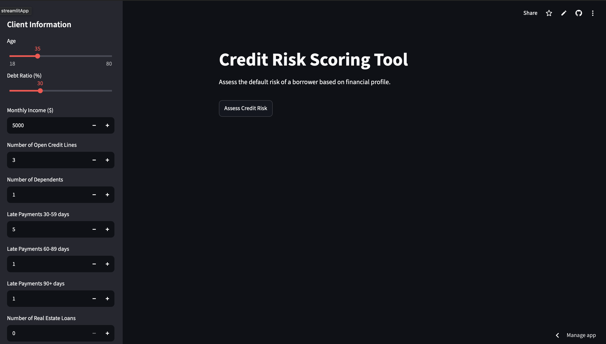
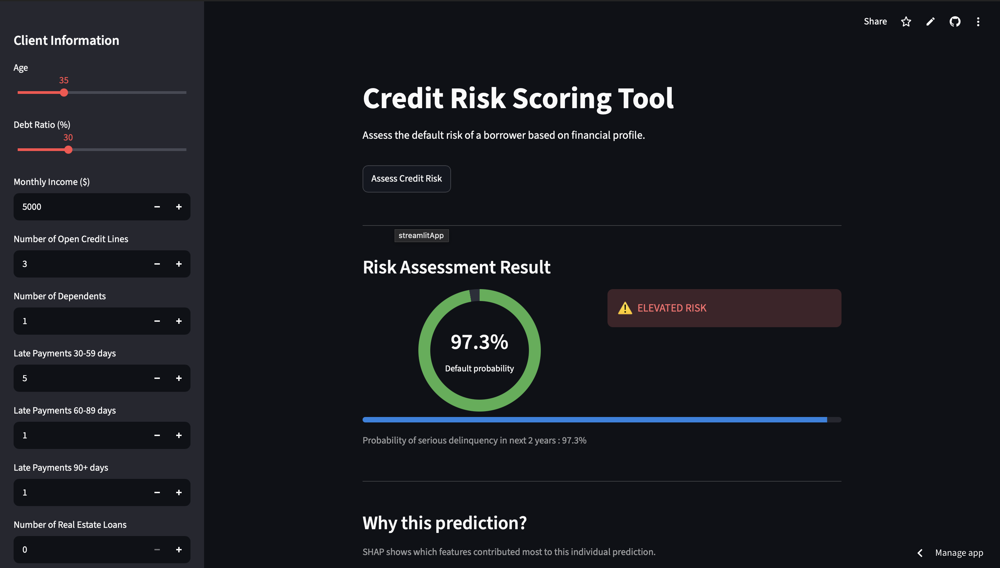
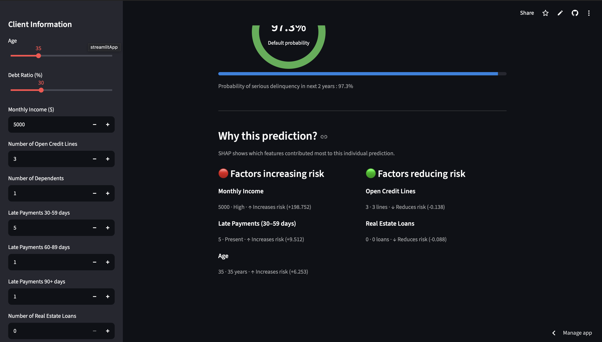

# Give Me Some Credit
[](https://give-me-some-credit-4lavdfwscb8yfjjnpidjvc.streamlit.app/)
## Project Overview

This project aims to predict the probability that a borrower will experience
serious delinquency within the next two years.

The target variable is `SeriousDlqin2yrs`.

## Dataset

The project uses the Give Me Some Credit dataset.

The training dataset contains the target variable.
The test dataset does not contain the target variable because it must be predicted.

## Models

Two classification models were evaluated.

The selected model is a Logistic Regression pipeline using:

- StandardScaler
- LogisticRegression
- `class_weight="balanced"`
- `random_state=42`
- `max_iter=1000`

## Validation Results

The selected model achieved the following results:

- Training AUC: `0.79564`
- Validation AUC: `0.80024`
- Absolute train-validation gap: `0.00460`

The small difference between the training and validation AUC indicates that
there is no clear sign of overfitting.

## Kaggle Results

- Public score: `0.80242`
- Private score: `0.80970`

The private score is slightly higher than the public score, which suggests that
the model generalizes well to unseen data.

## Project Workflow

The project follows this workflow:

1. Load the labeled training dataset.
2. Clean the data and handle missing values.
3. Split the data into training and validation sets.
4. Train the classification models.
5. Evaluate the models using ROC-AUC and classification metrics.
6. Save the selected trained model.
7. Load the unlabeled test dataset.
8. Generate probability predictions.
9. Create the final submission file.

## Installation

```bash
pip install -r requirements.txt
```

## Running the Project
Train and validate the model:
```bash
python -m src.train
```
Generate the final predictions:
```bash
python -m src.prediction
```
The prediction script generates a submission.csv file.
## Submission Format
The final submission file contains two columns:

	•	Id
	•	Probability
The Probability column contains the predicted probability of serious delinquency.
Repository Structure

## Streamlit Application

The final model is integrated into an interactive Streamlit application.

The interface provides:

1. Borrower profile inputs
2. Predicted default probability
3. Risk classification
4. Key factors influencing the prediction
5. SHAP-based model explanation

## Application Preview
  

## Repository Structure
```bash
give-me-some-credit/
├── notebooks/
├── src/
├── README.md
├── requirements.txt
└── .gitignore
```

## `requirements.txt`

```text
pandas
numpy
scikit-learn
joblib
jupyter
shap
```

